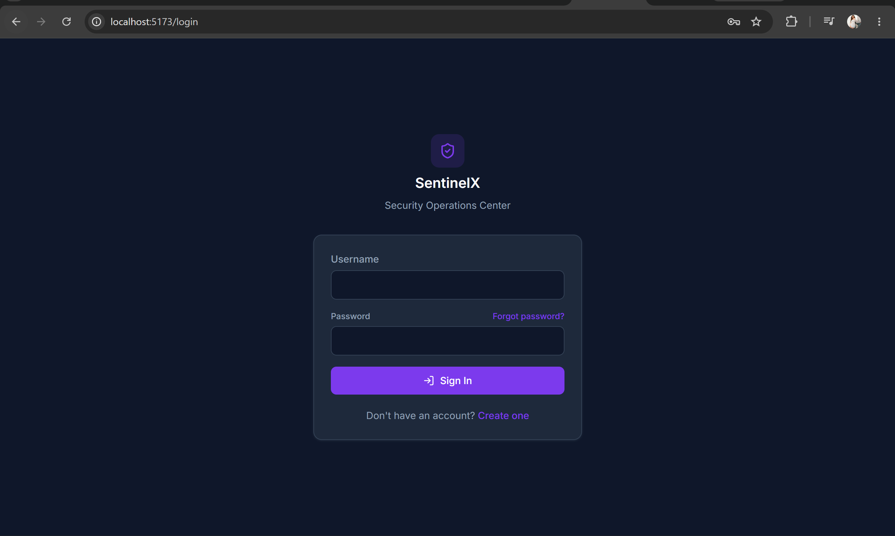
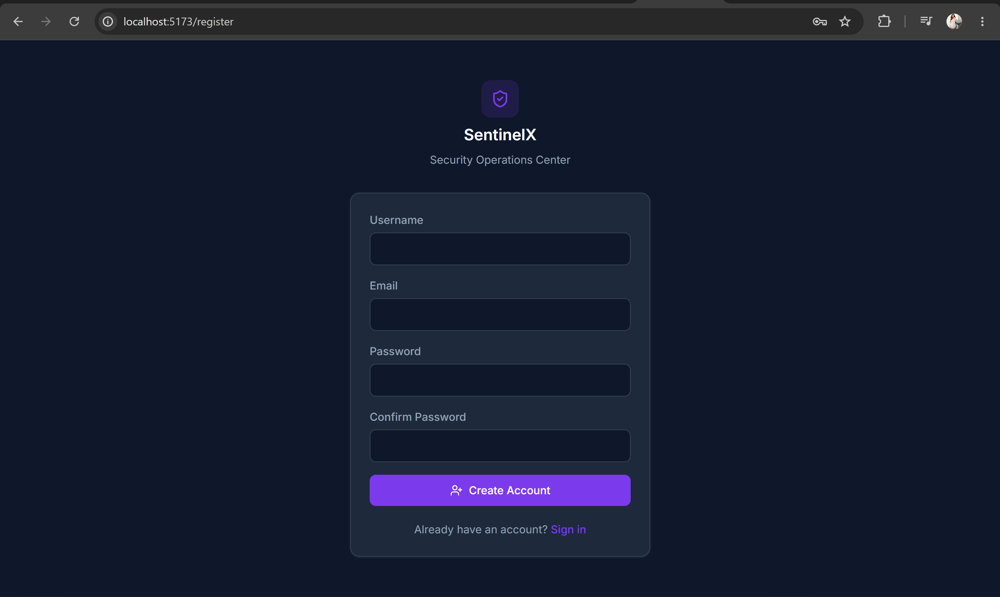
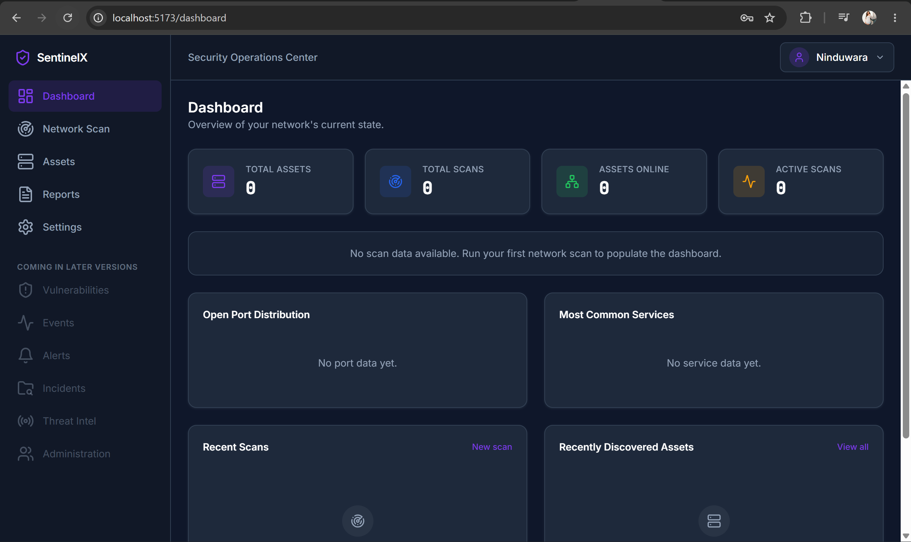
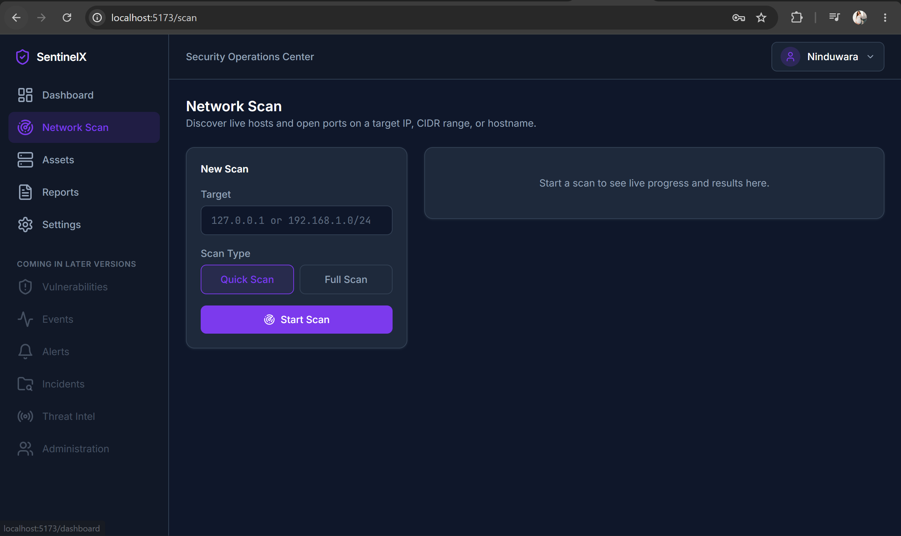
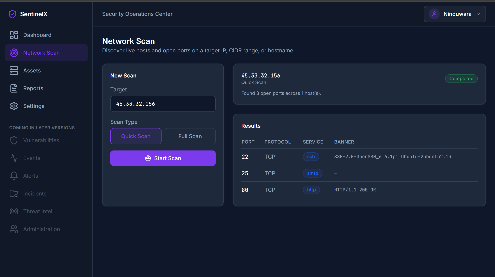
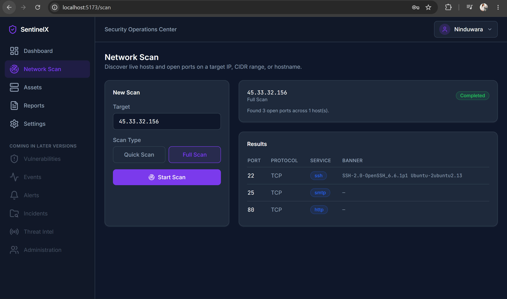
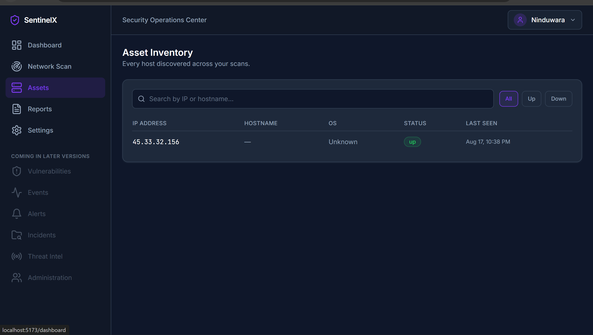
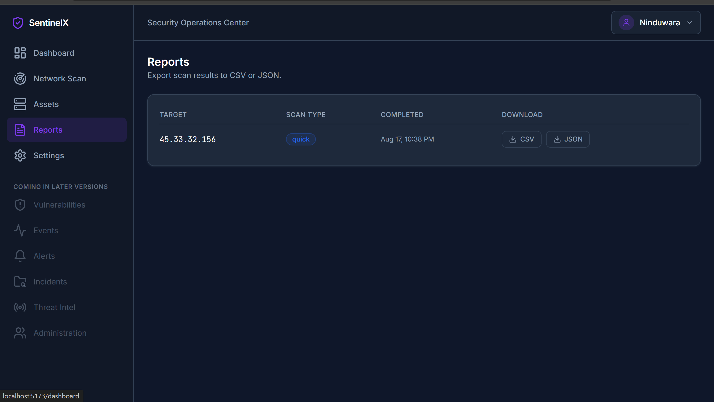
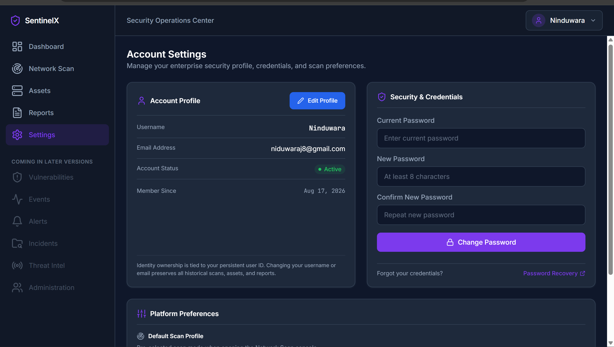

# 🛡️ SentinelX

<div align="center">

### Enterprise-Inspired Security Operations Center

**Discover. Analyze. Monitor.**

A full-stack SOC platform for authorized network discovery, asset inventory, service identification, security analytics, and report generation.

<br>

[](https://www.python.org/)
[](https://fastapi.tiangolo.com/)
[](https://react.dev/)
[](https://www.typescriptlang.org/)
[](https://www.postgresql.org/)
[](https://tailwindcss.com/)
[](https://vitejs.dev/)
[](https://www.docker.com/)
[](https://opensource.org/licenses/MIT)

<br>

> ⚠️ **For authorized security testing, defensive research, education, and laboratory environments only.**

</div>

---

## 📖 About SentinelX

**SentinelX** is an enterprise-inspired Security Operations Center (SOC) platform designed to provide a centralized view of network security posture.

The platform combines network reconnaissance, service discovery, asset inventory, analytics, account management, and scan reporting inside a modern SOC-style web interface.

Instead of relying on separate command-line tools and manually reviewing output, SentinelX provides a unified workflow:

```text
                    ┌─────────────────────┐
                    │   Authorized Target │
                    └──────────┬──────────┘
                               │
                               ▼
                    ┌─────────────────────┐
                    │   Network Discovery │
                    └──────────┬──────────┘
                               │
                               ▼
                    ┌─────────────────────┐
                    │ Service & Port Data │
                    └──────────┬──────────┘
                               │
                               ▼
                    ┌─────────────────────┐
                    │   Asset Inventory   │
                    └──────────┬──────────┘
                               │
                    ┌──────────┴──────────┐
                    ▼                     ▼
          ┌──────────────────┐   ┌──────────────────┐
          │ SOC Dashboard    │   │ Report Generator │
          └──────────────────┘   └──────────────────┘
```

---

## ✨ Features

| Feature                   | Description                                                                                                       |
| :------------------------ | :---------------------------------------------------------------------------------------------------------------- |
| 🔐 **Authentication**     | User registration and login workflow with account-based access to the SOC interface.                              |
| 🔍 **Network Discovery**  | Scan an IP address, CIDR range, or hostname to discover reachable hosts and exposed ports.                        |
| ⚡ **Quick Scan**          | Perform a focused scan using the platform's predefined essential service ports.                                   |
| 🔎 **Full Scan**          | Perform a broader port scan for more comprehensive service discovery.                                             |
| 🧩 **Service Detection**  | Identifies discovered services and protocols associated with open ports.                                          |
| 🏷️ **Banner Detection**  | Collects available service banner information for discovered services.                                            |
| 🖥️ **Asset Inventory**   | Maintains a centralized list of hosts discovered during scans.                                                    |
| 📊 **SOC Dashboard**      | Displays network statistics, scan activity, open-port distribution, service distribution, and recent discoveries. |
| 📈 **Security Analytics** | Uses interactive charts to visualize discovered port and service information.                                     |
| 📄 **Reporting**          | Automatically stores completed scans and allows results to be downloaded in CSV and JSON formats.                 |
| ⚙️ **Account Settings**   | Manage account information, credentials, and default scan preferences.                                            |
| 🐳 **Docker Support**     | Run the application stack using Docker Compose for easier deployment.                                             |

---

## 🧭 Platform Workflow

SentinelX is designed around a simple analyst workflow:

### 1. Authenticate

Create an account or sign in to access the SOC platform.

### 2. Start a Scan

Specify a target such as:

```text
192.168.1.0/24
```

or:

```text
192.168.1.10
```

or:

```text
example.internal
```

Then choose between **Quick Scan** and **Full Scan**.

### 3. Analyze Results

SentinelX presents:

* Open ports
* Protocols
* Identified services
* Available service banners
* Scan completion status
* Number of discovered hosts

### 4. Review Assets

Discovered hosts are stored in the **Asset Inventory**, allowing operators to review their status and last-seen information.

### 5. Monitor the SOC Dashboard

The dashboard aggregates discovered information into a centralized view containing:

* Total assets
* Total scans
* Online assets
* Active scans
* Open-port distribution
* Common service distribution
* Recent scans
* Recently discovered assets

### 6. Export Results

Completed scans are stored in the reporting section and can be downloaded as:

* CSV
* JSON

---

## 🖥️ Interface Preview

### 🔐 Authentication

SentinelX provides dedicated authentication screens for account creation and secure sign-in.





---

### 📊 SOC Dashboard

The dashboard provides a centralized overview of current network activity and discovered infrastructure.



Key dashboard metrics include:

* Total assets
* Total scans
* Assets online
* Active scans
* Open-port distribution
* Most common services
* Recent scans
* Recently discovered assets

---

### 🔍 Network Scan

The Network Scan console allows users to launch discovery operations against an authorized target.



Supported target formats include:

* Individual IP addresses
* CIDR ranges
* Hostnames

Scan modes:

* **Quick Scan**
* **Full Scan**

---

### ⚡ Quick Scan Results

Quick Scan provides a focused discovery workflow for essential service ports.



The result view displays:

* Port
* Protocol
* Service
* Banner
* Scan status
* Number of discovered hosts

---

### 🔎 Full Scan Results

Full Scan provides a broader port discovery operation.



The same result interface provides a consistent view of discovered services and available banner information.

---

### 🖥️ Asset Inventory

All discovered hosts are centralized inside the Asset Inventory.



The inventory supports:

* IP address tracking
* Hostname information
* Operating-system information when available
* Online/offline status
* Last-seen timestamps
* Search and status filtering

---

### 📄 Reports

Completed scans are automatically stored in the reporting interface.



Reports currently support:

* CSV export
* JSON export
* Quick Scan history
* Full Scan history
* Scan completion timestamps

---

### ⚙️ Account & Platform Settings

Users can manage their account and scanning preferences directly from the SOC interface.



Available settings include:

* Account profile
* Password changes
* Account status
* Scan profile preferences
* Quick Scan / Full Scan default selection

---

## 📊 Core Capabilities

### Network Discovery

SentinelX accepts authorized:

* IPv4 addresses
* CIDR ranges
* Hostnames

The discovery engine identifies reachable hosts and examines accessible TCP services.

### Port & Service Discovery

Open ports are presented together with detected protocol and service information.

Example:

```text
PORT    PROTOCOL    SERVICE
22      TCP         SSH
25      TCP         SMTP
80      TCP         HTTP
```

### Banner Collection

Where available, SentinelX collects service responses and banners to provide additional context about exposed services.

Example:

```text
SSH-2.0-OpenSSH_6.6.1p1 Ubuntu-2ubuntu2.13
```

### Asset Management

Each discovered host becomes part of the centralized asset inventory, allowing historical discoveries to remain associated with the SOC account.

### Dashboard Analytics

Scan information is transformed into visual metrics using interactive charts, providing a faster way to interpret:

* Port distribution
* Service distribution
* Scan activity
* Asset activity

---

## 🛠️ Tech Stack

| Layer                | Technology              | Role                                 |
| :------------------- | :---------------------- | :----------------------------------- |
| **Frontend**         | React 18                | SOC web application                  |
| **Language**         | TypeScript              | Strongly typed frontend development  |
| **Styling**          | Tailwind CSS            | Responsive dark SOC interface        |
| **Build Tool**       | Vite                    | Frontend development and bundling    |
| **Visualization**    | Chart.js                | Dashboard analytics                  |
| **Backend**          | Python                  | Core application and scanning logic  |
| **API Framework**    | FastAPI                 | REST API and backend services        |
| **Database**         | PostgreSQL              | Persistent application and scan data |
| **ORM / Data Layer** | SQLAlchemy              | Database interaction                 |
| **Containerization** | Docker / Docker Compose | Reproducible deployment              |
| **Version Control**  | Git / GitHub            | Source control and collaboration     |

---

## 🏗️ System Architecture

```text
┌─────────────────────────────────────────────────────────┐
│                    React SOC Frontend                   │
│                                                         │
│ Dashboard │ Network Scan │ Assets │ Reports │ Settings │
└────────────────────────────┬────────────────────────────┘
                             │
                             │ HTTP / JSON
                             ▼
┌─────────────────────────────────────────────────────────┐
│                    FastAPI Backend                      │
│                                                         │
│ Authentication │ Scan API │ Asset API │ Report API      │
└───────────────┬─────────────────────┬───────────────────┘
                │                     │
                ▼                     ▼
┌────────────────────────┐   ┌────────────────────────────┐
│   Network Discovery    │   │       PostgreSQL           │
│                        │   │                            │
│ • Host Discovery       │   │ • Users                    │
│ • Port Scanning        │   │ • Scan History             │
│ • Service Detection    │   │ • Discovered Assets        │
│ • Banner Collection    │   │ • Scan Results             │
└────────────┬───────────┘   └────────────────────────────┘
             │
             ▼
      Authorized Target
```

---

## 📁 Project Structure

The repository is organized as a full-stack application with dedicated backend, frontend, infrastructure, documentation, datasets, scripts, and testing directories.

```text
SentinelX/
│
├── backend/                  # FastAPI backend
│   ├── app/
│   │   ├── api/              # API route controllers
│   │   ├── core/             # Application configuration/security
│   │   ├── db/               # Database models and sessions
│   │   ├── services/         # Discovery and application services
│   │   └── main.py            # FastAPI application entry point
│   ├── Dockerfile
│   └── requirements.txt
│
├── frontend/                 # React + TypeScript frontend
│   ├── src/
│   │   ├── components/       # Reusable UI components
│   │   ├── pages/            # Dashboard, Scan, Assets, Reports, Settings
│   │   ├── services/         # Frontend API/service layer
│   │   ├── App.tsx
│   │   └── main.tsx
│   ├── package.json
│   ├── tailwind.config.js
│   └── vite.config.ts
│
├── datasets/                 # Project datasets and supporting data
├── docker/                   # Docker-related project configuration
├── docs/                     # Project documentation
├── public/                   # Public frontend/static assets
├── scripts/                  # Utility and automation scripts
├── src/                      # Supporting project source files
├── test/                     # Test files
│
├── .env.example              # Environment variable template
├── .gitignore
├── API_DOCS.md               # API documentation
├── LICENSE                   # MIT license
├── docker-compose.yml        # Full-stack container orchestration
├── package.json
├── vite.config.ts
└── README.md
```

---

## ⚙️ Installation & Setup

### Prerequisites

Before running SentinelX locally, ensure you have:

* **Python 3.10+**
* **Node.js 18+**
* **npm**
* **PostgreSQL**
* **Docker & Docker Compose** *(recommended)*

---

### 🐳 Option A — Docker Compose

Clone the repository:

```bash
git clone https://github.com/niduwara-j/SentinelX.git
cd SentinelX
```

Start the full application stack:

```bash
docker-compose up --build -d
```

Once the containers are running:

```text
Frontend  → http://localhost:5173
Backend   → http://localhost:8000
API Docs  → http://localhost:8000/docs
```

---

### 💻 Option B — Manual Setup

#### 1. Clone the repository

```bash
git clone https://github.com/niduwara-j/SentinelX.git
cd SentinelX
```

#### 2. Configure environment variables

Create your environment file from the included template:

```bash
cp .env.example .env
```

On Windows, copy the file manually if necessary.

Review the environment variables and configure your local database and application settings.

---

### 3. Backend

Navigate to the backend directory:

```bash
cd backend
```

Create a virtual environment:

```bash
python -m venv venv
```

#### Windows

```bash
.\venv\Scripts\activate
```

#### Linux / macOS

```bash
source venv/bin/activate
```

Install dependencies:

```bash
pip install -r requirements.txt
```

Start the development server:

```bash
uvicorn app.main:app --reload --port 8000
```

Backend API:

```text
http://127.0.0.1:8000
```

Swagger documentation:

```text
http://127.0.0.1:8000/docs
```

---

### 4. Frontend

Open another terminal:

```bash
cd frontend
npm install
npm run dev
```

Frontend:

```text
http://localhost:5173
```

---

## 🚀 Usage

### Step 1 — Create an Account

Open:

```text
http://localhost:5173/register
```

Create your SentinelX account.

### Step 2 — Sign In

Open:

```text
http://localhost:5173/login
```

Sign in using your credentials.

### Step 3 — Start a Network Scan

Navigate to:

```text
Dashboard → Network Scan
```

Enter an authorized target:

```text
192.168.1.0/24
```

or:

```text
192.168.1.10
```

Choose:

```text
Quick Scan
```

or:

```text
Full Scan
```

Then select **Start Scan**.

### Step 4 — Review the Results

Review discovered:

* Hosts
* Open ports
* Protocols
* Services
* Available banners

### Step 5 — Review Assets

Open:

```text
Assets
```

to view discovered infrastructure.

### Step 6 — Review Reports

Open:

```text
Reports
```

to access completed scans and download CSV or JSON results.

### Step 7 — Configure Preferences

Use:

```text
Settings
```

to manage account information, credentials, and the default scan profile.

---

## 🔬 Quick Scan vs Full Scan

| Mode             | Purpose                                                           |
| :--------------- | :---------------------------------------------------------------- |
| ⚡ **Quick Scan** | Faster assessment using a predefined set of common service ports. |
| 🔎 **Full Scan** | Broader TCP port discovery for more comprehensive coverage.       |

Quick Scan is suitable when speed is the priority, while Full Scan provides wider visibility into exposed services.

---

## 📄 Reporting

SentinelX preserves completed scan history inside the Reports interface.

Currently supported export formats:

### CSV

Useful for:

* Spreadsheet analysis
* Filtering
* Data processing
* Security documentation

### JSON

Useful for:

* Programmatic processing
* Integrations
* Automation
* Structured archival

Example report workflow:

```text
Completed Scan
      │
      ▼
Stored Scan Result
      │
      ├──► CSV Export
      │
      └──► JSON Export
```

---

## 🗺️ Roadmap

SentinelX is being developed as a broader SOC platform. The current release focuses on the network discovery and asset-management foundation.

### ✅ Current Release

* [x] User registration and authentication
* [x] SOC dashboard
* [x] Network discovery
* [x] Quick Scan
* [x] Full Scan
* [x] Port discovery
* [x] Service identification
* [x] Banner collection
* [x] Asset inventory
* [x] Scan history
* [x] CSV reporting
* [x] JSON reporting
* [x] Account settings
* [x] Scan preferences
* [x] Docker-based deployment

### 🚧 Planned / Future Versions

* [ ] Vulnerability assessment engine
* [ ] CVE intelligence and correlation
* [ ] SIEM event ingestion
* [ ] Event correlation rules
* [ ] Security alerts
* [ ] Incident management
* [ ] Threat intelligence integration
* [ ] Administration and advanced access control
* [ ] MITRE ATT&CK mapping
* [ ] Advanced reporting and compliance exports
* [ ] Expanded network topology visualization

---

## 🔒 Security & Ethical Use

SentinelX performs active network discovery and therefore must only be used against systems and networks where you have authorization.

### ✅ Permitted Use

* Your own devices and infrastructure
* Authorized penetration-testing engagements
* University and educational laboratories
* Isolated cybersecurity labs
* Defensive security research
* Controlled virtual networks

### ❌ Prohibited Use

Do **not** use SentinelX to scan or probe:

* Systems you do not own
* Networks without authorization
* Third-party infrastructure
* Public systems without explicit permission

The authors are not responsible for misuse of this software, unauthorized activity, damage, disruption, data loss, or violations of applicable laws and regulations.

---

## 👥 Team

| Role                                   | Contributor                  | GitHub                                       |
| :------------------------------------- | :--------------------------- | :------------------------------------------- |
| **Full Stack & Security Architecture** | **Niduwara Jayasiri**        | [@niduwara-j](https://github.com/niduwara-j) |
| **Frontend & SOC Analytics**           | **DijenthinI Mariya Xavier** | [@Dijenthini](https://github.com/Dijenthini) |

---

## 🙏 Acknowledgments

SentinelX was built using and inspired by a range of open-source technologies and security concepts.

* [FastAPI](https://fastapi.tiangolo.com/) — modern Python API framework
* [React](https://react.dev/) — component-based frontend development
* [TypeScript](https://www.typescriptlang.org/) — strongly typed application development
* [Tailwind CSS](https://tailwindcss.com/) — utility-first interface styling
* [Chart.js](https://www.chartjs.org/) — interactive dashboard visualizations
* [PostgreSQL](https://www.postgresql.org/) — relational database platform
* [Docker](https://www.docker.com/) — containerization and deployment

---

## ⭐ Support the Project

If you find SentinelX useful for cybersecurity learning, research, or defensive security work, consider giving the repository a ⭐ on GitHub.

Your support helps us continue improving the project and expanding its SOC capabilities.

---

## 📬 Contact

### Niduwara Jayasiri

* GitHub: [@niduwara-j](https://github.com/niduwara-j)
* LinkedIn: [Niduwara Jayasiri](https://www.linkedin.com/)

### Dijenthini Mariya Xavier

* GitHub: [@Dijenthini](https://github.com/Dijenthini)
* LinkedIn: [Dijenthini Mariya Xavier](https://www.linkedin.com/)

---

## 📄 License

SentinelX is distributed under the **MIT License**.

See [`LICENSE`](LICENSE) for the complete license text.

---

<div align="center">

### 🛡️ SentinelX

**Discover. Analyze. Monitor.**

Built with **FastAPI · React · TypeScript · PostgreSQL · Docker**

</div>
